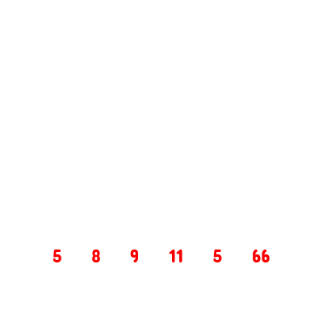

# Addition Triangle

- A input field collects space separated integers (min 2, max 11)
- A button generates the triangle for given input
- It should create a good triangle shape. Adjust space accordingly (no css adjustments, use spaces)
- In addition triangle, each integer is sum of its base integers, the bottom most base is the input received
- Each step should appear in certain interval

## Sample output

